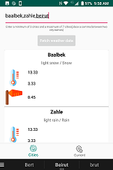
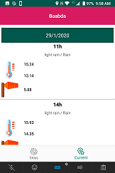

# Weather_App
>A sample app for checking weather in multiple cities or current location

This app consists of 3 screens (below you may find some description and screenshots):
* Splash Screen: used just for branding purpose, no logic behind it
* Multiple cities screen: initially the app parses a Json file containing a list of cities, and returns
a HashMap of city name to city id, which will be used for fetching data.
In this screen the user can enter comma separated city names in an EditText, and click on "Fetch weather data" button.
After that, data is fetched and displayed for relevent cities.
* Current city screen: in this screen, the user should give permission for the app to use the location permission.
When the permission is given, the app would fetch the latitude and longitude of the user's current location, fetch relative weather data,
clube them by days and display them.

## Technologies
The app is build with latest libraries and technologies using the below
* **Kotlin** as the main and only code
* **MVVM** approach
* **Retrofit2** coupled with **OkHttp** and **Gson** for API calls
* **Navigation component** for navigating between fragments (only use within the app is in the BottomNavigationView in the MainActivity)

## Future work And Improvments
* Unit test and Code coverage
* Saving state when switching between fragments
* UX/UI tweaks
* Canceling requests onPause/onDestroy of the fragment
* More handling for the location service (like asking the user to turn on the GPS)
